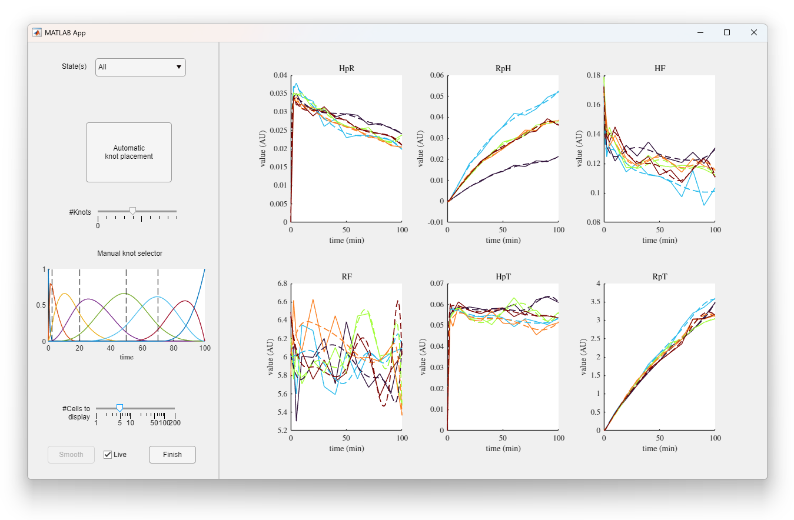
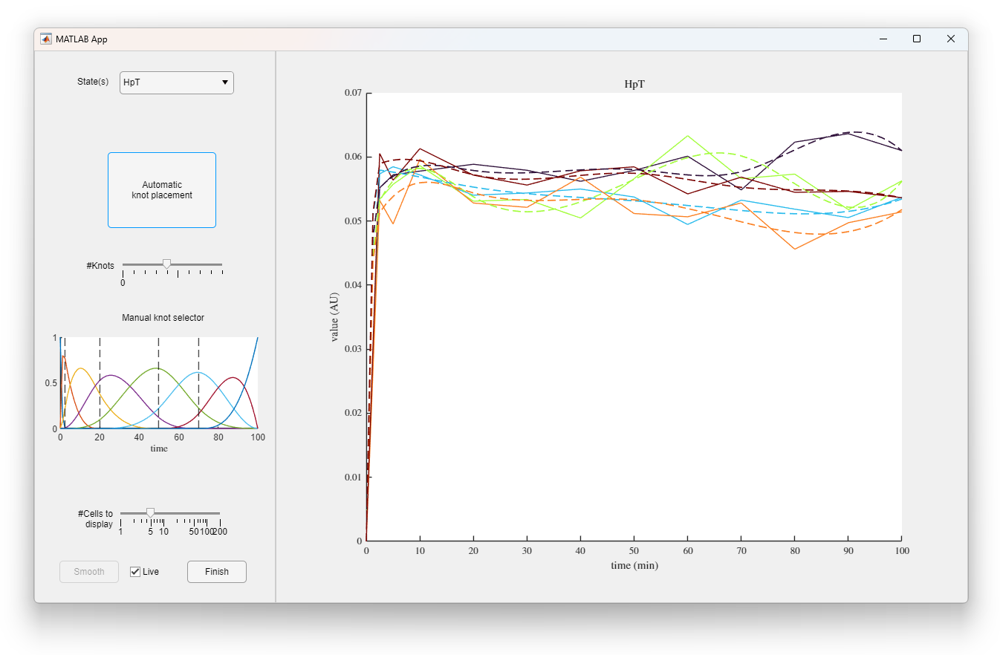
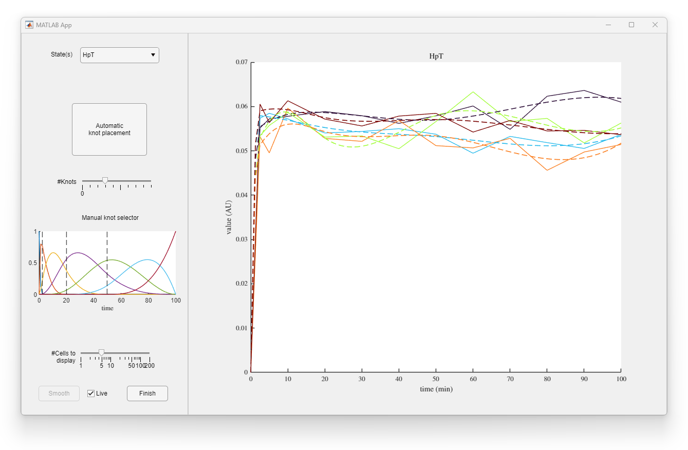
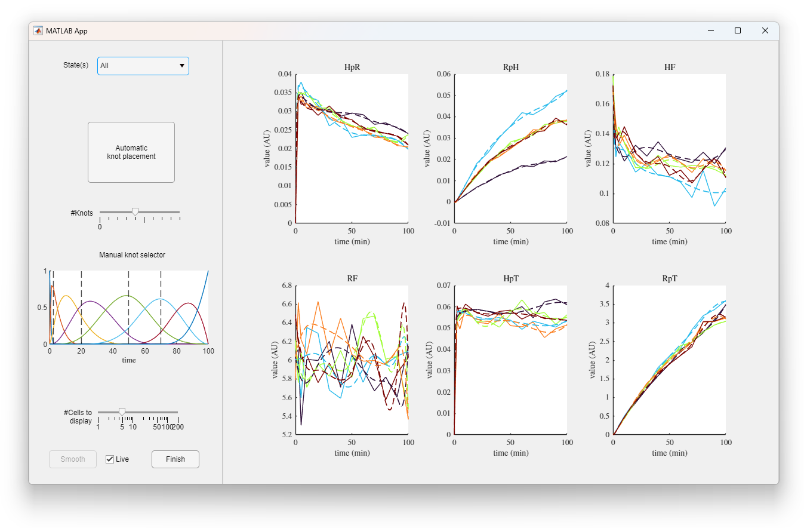

# GMGTS: Gradient Matching Global Two-Stage
_MATLAB®  code package for (ODE-based) nonlinear mixed-effects (NLME) model inference using GMGTS as presented in [1]_

&nbsp;

## Quickstart
Install MATLAB® R2021a with IQM Tools Pro Version 1.2.2 (02.01.2017) and Monolix 2021R2.

Run `example.m` to generate data from an example ODE-based ME model and recover the random effects distribution using GMGTS.

Run the `inference_*.m` files to reproduce the results in [1].

The folder `FP_data/` contains the FP maturation microscopy data used for inference.

All subclasses and auxiliary files related to the System, Generator, and Estimator classes are contained in `Components/`.

The `System` class produces functions and integrations from an IQM Tools model file.

The `Generator` class generates heterogeneous single-cell time series data from a specified NLME model.

The `Estimator` class infers underlying ODE parameter (random effect) distributions from single-cell time series using the GMGTS [1] and Global Two-Stage (GTS) [2] methods.

&nbsp;


## Usage
### `GMGTS()` utility function
`GMGTS` attempts to recover the distribution parameters `b` and `D` of a mixed-effects model
```
    dx_i(t)/dt = g(t, x_i(t)) beta_i + h(t, x_i(t))
    beta_i ~ (log)Normal(b, D)                          (i = 1, ..., N)
```
from measurements `(t_j, y_ij)`, where `y_ij` are vectors of observed components of `x_i(t_j)` perturbed by measurement noise.

`GMGTS` builds on the GTS framework, using gradient matching to obtain cell-specific estimates after smoothing the measurements.
 
`out = GMGTS(model_file, data, ...)` infers random effect distributions of the system specified in the IQM `model_file` (instructions for setting up the model file are given below) from measurements given in `data`. Here `data` is either a `TxLxN`-dimensional array with measurements at `T` time points for `L` observables and `N` cells (individuals), or a `1x1 struct` with its measurements stored in a field named `y` or `traces`. The `estimates` are returned as a struct containing the inferred random effect mean `b` and covariance matrix `D`, individual estimates `beta`, and predicted states. Additional arguments are passed to the System and Estimator constructors, see the details below.

`out = GMGTS(model_file, data, t, ...)` assumes which the measurements were taken at time points `t`. If `data` is a struct, `t` is ignored and assumed to be a field of `data`.

`out = GMGTS(model_file, data, t, observed, ...)` specifies the indices of the observables with respect to the system determined by `model_file` through `observed`. If `data` is a struct, `observed` is ignored and assumed to be a field of `data`.

`out = GMGTS(model_file, data, t, observed, init, ...)` integrates the ODE system from the initial values given in `init` to make state predictions. If `data` is a struct, `init` is ignored and assumed to be a field of `data`.

`out = GMGTS(_, Plot=false, ...)` disables plots with parameter estimates, the inferred random effects distribution, model predictions, and any smoothed measurements (enabled by default).

`[out, estimator] = GMGTS(model_file, data, ...)` also returns the instantiated `Estimator` object.

See `System` and `Estimator` for a description of additional input arguments.

&nbsp;


### Interactive smoothing app 
Passing the Name-Value argument `InteractiveSmoothing=true` to either `GMGTS()` or the `Estimator()` constructor causes the interactive smoothing app to start during estimation. This app provides quick visual feedback when selecting B-spline smoothing knots. Upon startup, the app window appears as follows.


Unless the arguments `AutomaticKnots=false` has been passed, the knot placement heuristic will guess appropriate knot locations for each state. The 'States(s)' dropdown menu is used to select the active state(s). When set to 'All', the settings for the first state are shown in the left panel. Modifying any setting will affect every state.

Suppose we would like to clean up the wiggle at the end of the interval for state 'HpT'. After changing the 'States(s)' value, the right panel is focused on state 'HpT':


It may be appropriate to remove the last knot; to do so, right click near the corresponding vertical line in the 'Manual knot selector' window (left clicking anywhere on the window adds a knot). The result looks as follows:


Notice the curves are now smoother at the end of the interval, and that the '#Knots' slider has moved back. Alternatively, we could have dragged the '#Knots' slider to replace this state's set of knots with equidistant knots. To revert back to the heuristically placed knots for this state, click the 'Automatic knot placement' button. Once we are satisfied with this state's smoothing, we can return by setting the 'State(s)' dropdown menu to 'All':


The number of displayed cells may be changed using the '#Cells' slider. This is useful to inspect the effect of the knot locations on example cells more closely. Finally, for large systems, smoothing may be too slow for interactivity. In this case, unchecking the 'Live' checkbox postpones any smoothing with updated settings until the 'Smooth' button is pressed. Once satisfied with the smoothing for each state, click the 'Finish' button to continue with the rest of the mixed-effect estimation.

&nbsp;

### `System` class for ODE functions and simulations
The `System` class handles ODE integration, evaluation of (functions derived from) the system's right-hand side, and corresponding partial derivatives as part of the Estimator and Generator classes.

`system = System(model_file)` instantiates a `System` object by processing an IQM tools `model_file`. The specified ODE system should be linear in parameters, otherwise, unexpected results will follow. The model file should contain the model name, the differential equations and initial conditions for each state, and nominal values for the parameters (model reactions and functions are not yet supported). The `model_file` argument should be the path to a `txt` file. Its contents should be structured as follows:
```
********** MODEL NAME
Simple model
********** MODEL STATES
d/dt(A) = k1 - k2*A
d/dt(B) = k2*A
A(0) = 1
B(0) = 0
********** MODEL PARAMETERS
k1 = 0.1
k2 = 0.5
```

`system = System(model_file, 'FixedParameters', names)` treats the parameters specified in `names` as constant, fixing them at their corresponding nominal values prescribed in `model_file`.

`system = System(model_file, 'FixedParameters', names, 'FixedValues', values)` alternatively fixes the parameters in `names` at the given `values`. The arguments `names` and `values` should have equal numbers of elements.

&nbsp;


### `Generator` class to generate data from ODE-based ME models
#### Constructor and methods syntax
`generator = Generator(system, ...)` instantiates a `Generator` object to
draw parameters from a specified random effects distribution, integrate
ODE systems to obtain cell trajectories, and produce measurements by
perturbing the trajectories with measurement noise.

`measurements = generator.generate()` generates a struct containing
fields 'traces' (perturbed trajectories), 't' (measurement time points), 'observed' (observed state indices),
'init' (assumed initial conditions), 'T' (number of time points), 'L'
(number of observables), and 'N' (number of cells).

`measurements = generator.generate(beta`) uses the cell-specific 
(P-dimensional) parameter vectors in beta (NxP-dimensional) instead of
randomly drawn random effects (useful for boostrapping tests).

`[measurements, ground_truth] = generator.generate(...)` additionally
returns the complete `ground_truth` struct, which also contains the 
population parameters, the cell-specific parameters, and the unperturbed
cell trajectories.

`plot(generator)` plots generated trajectories and corresponding 
underlying gradients for each state.

#### Constructor Name-Value arguments
`N` - Number of cells to generate  
`20 (default) | positive integer`

`t` - Measurement times  
`0:20:200 (default) | numeric vector`

`error_const` - Additive noise standard deviation  
`0 (default) | positive scalar`

`error_std` - Multiplicative noise standard deviation  
.05 (default) | positive scalar

`init` - Initial conditions  
`numeric vector`  
(uses the initial conditions specified by `system` by default)

`b` - Random effects mean vector  
`numeric vector`  
(uses the nominal parameter vectors of `system` by default)

`D_mult` - Random effects (common) coefficient of variation  
`.1 (default) | positive scalar`  
(ignored when `D` is specified, see below)

`D` - Random effects covariance matrix  
`positive semidefinite matrix`

`observed` - Observed state indices  
`1:system.K (default) | positive integer vector`

`lognormal` - Use log-normal random effects distribution  
`false (default) | true`  
(if true, the log-mean `Lb` and log-covariance matrix `LD` are approximated
by moment matching: `LD==log(1+D./(b'*b))` and `Lb==log(b)-diag(LD)/2`)

&nbsp;

### `Estimator` class to manage the stages of the GTS and GMGTS methods
#### Constructor
`estimator = Estimator(system, data, ...)` instantiates an `Estimator`
object to infer random effect distributions of the specified
`K`-dimensional (ODE) system (see the `System` class) from measurements
given in data. Here data is either a `TxLxN`-dimensional array with
measurements at `T` time points for `L` observables and `N` cells
(individuals), or a `1x1 struct` with its measurements stored in a field
named `'y'` or `'traces'` . This struct may additionally contain fields
`'t'`, a (`T`-dimensional) array of measurement time points, `'observed'`, an
(`L`-dimensional) vector of indices of observed states (with respect to
the specified system), and `'init'`, a (`K`-dimensional) vector of initial
conditions. Default values are imputed for any omitted additional
fields.

`estimator = ESTIMATOR(system, traces, t, observed, init, ...)` provides
an alternative constructor with (optional) positional arguments.
Omitting `t`, `observed`, or `init` causes default values to be used for the
omitted and all subsequent arguments. The defaults are:
`t = 0:size(data, 1)-1`, `observed = 1:size(data, 2)`, and `init = 1e-8*ones(1, system.K)`

#### Methods
`varargout = estimator.estimate()` carries out estimation for the
specified stages and method(s), returning two arguments when both
both methods are used.

`varargout = estimator.estimate(silent)` suppresses console prompts 
during estimation if `silent==true`.

`plot(estimator, ...)` produces relevant plots for the executed stages
and methods.

`plot(estimator, True=ground_truth, ...)` additionally plots the 
data-generating parameters and trajectories contained in the `ground_truth` struct for reference; see the `Generator` class.

`plot(estimator, States=states, ...)` restricts the plots to the
specified `states`, which may consist of indices or state labels.

`plot(estimator, Parameters=parameters, ...)` restricts the plots to
the specified `parameters`, which may consist of indices or labels.

`plot(estimator, MaxCells=N, ...)` only plots data and predictions for
the first `N` cells.

#### Constructor Name-Value arguments
`Stages` - GMGTS and GTS stages to execute  
`2 (default) | 0 | 1`  
(GMGTS either executes smoothing only (`0`), smoothing
and first-stage estimates (`1`), or everything including the
second-stage estimates (`2`); GTS executes the first-stage only (`0`, `1`) or everything (`2`))

`Methods` - Frameworks to use  
`"GMGTS" (default) | ["GMGTS" "GTS"] | "GTS"`

`AutoKnots` - Use automatic B-spline knot placement heuristic  
`true (default) | false`

`Knots` - Knot locations used for B-spline smoothing  
`numeric vector | cell array`  
(either a single numeric vector of knot locations for all observed
states, or a cell array of state-specific knot location vectors)

`InteractiveSmoothing` - Use the interactive app to smooth measurements  
`true (default) | false`

`LB` - Parameter space lower bounds  
`numeric vector`  
(.25 times the nominal parameter values specified by `system` by default)

`UB` - Parameter space upper bounds  
`numeric vector`  
(4 times the nominal parameter value specified by `system` by default)

`PositiveState` - Force smoothed/predicted state positivity  
`true (default) | false` 

`TimePoints` - Time point grid for first-stage optimization  
`numeric vector`  
(10 equidistant intervals in the measurement interval by default)

`MaxIterationsSM` - Maximum number of smoothing iterations  
`20 (default) | positive integer`

`ConvergenceTolSM` - Convergence step tolerance for smoothing iterations  
`1e-3 (default) | positive scalar`

`NMultiStartFS` - Number of multistarts for first-stage initialization  
`10 (default) | positive integer`

`MaxIterationsFS` - Maximum number of first-stage iterations  
`5 (default) | positive integer`

`ConvergenceTolFS` - Convergence step tolerance for first-stage iterations  
`2e-3 (default) | positive scalar`

`MaxIterationsSS` - Maximum number of second-stage iterations  
`10 (default) | positive integer`

`ConvergenceTolSS` - Convergence step tolerance for second-stage iterations  
`1e-3 (default) | positive scalar`

`LogNormal` - Infer log-normal random effect distribution  
`false (default) | true`

`Prior` - Include parameter prior (same for each cell)  
`struct('mean', 0, 'prec', 0) (default) | struct`  
(the struct should have fields 'mean' specifying the prior mean,
and either `'prec'`, the prior precision matrix, `'sd'`, the prior
component-wise standard deviations, or `'cv'`, the prior component-
wise coefficients of variation; if multiple fields indicating
variation are included, only one is considered with precedence `'cv'`,
`'sd'`, `'prec'` from high to low)


&nbsp;

## References
[1] van Oppen, Yulan B. and Milias-Argeitis, Andreas (2024). Gradient matching accelerates mixed-effects inference for biochemical networks. _Manuscript submitted for publication_.

[2] Davidian, Marie. (2017) _Nonlinear models for repeated measurement data._ London: Routledge.

&nbsp;

## DISCLAIMER
Permission is hereby granted, free of charge, to any person obtaining a copy
of this software and associated documentation files (the "Software"), to deal
in the Software without restriction, including without limitation the rights
to use, copy, modify, merge, publish, distribute, sublicense, and/or sell
copies of the Software, and to permit persons to whom the Software is
furnished to do so, subject to the following conditions:

The above copyright notice and this permission notice shall be included in all
copies or substantial portions of the Software.

THE SOFTWARE IS PROVIDED "AS IS", WITHOUT WARRANTY OF ANY KIND, EXPRESS OR
IMPLIED, INCLUDING BUT NOT LIMITED TO THE WARRANTIES OF MERCHANTABILITY,
FITNESS FOR A PARTICULAR PURPOSE AND NONINFRINGEMENT. IN NO EVENT SHALL THE
AUTHORS OR COPYRIGHT HOLDERS BE LIABLE FOR ANY CLAIM, DAMAGES OR OTHER
LIABILITY, WHETHER IN AN ACTION OF CONTRACT, TORT OR OTHERWISE, ARISING FROM,
OUT OF OR IN CONNECTION WITH THE SOFTWARE OR THE USE OR OTHER DEALINGS IN THE
SOFTWARE.
